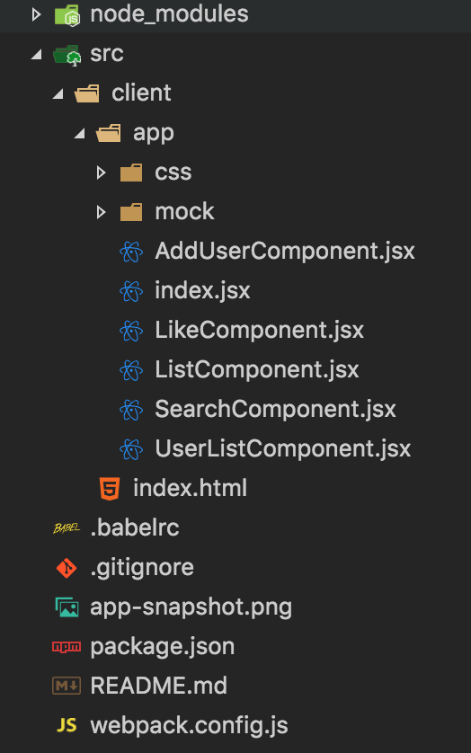

# DEV-List : React based application 

Webpack module bundler with babel is used to resolve dependencies and convert REACT and ES6 code to compatible version.

## To run application

1. Resolve dependencies run command "npm install" in cmd/terminal
1. Next generate assets used by application  run command "num run dev"
1. Finally serve the application using command "npm start" in another cmd/terminal
1. In browser hit url http://localhost:3000

# How application is structured

- package.json holds application dependencies and run configuration
- Webpack pack configuration in <a href='webpack.config.js'>webpack.config.js</a>
- .bablerc
- All code is in src/client
- all dev code (Component and styles) is in src/client/app
- After build src/client/publish holds the bundle and is used by our running application
- index.html is the main html file in src/client which is loaded when you run the application
- Driving component is index.jsx which includes its dependencies including styles

## App Snapshot
 

